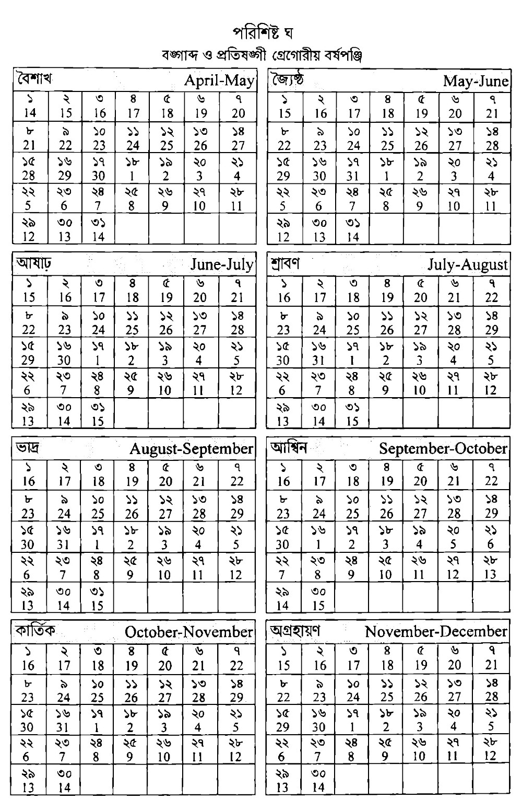

Python package for Bengali (i.e Bangabdo) date and time 


মোটাদাগে বর্তমানে তিনটি বাংলা বর্ষপঞ্জি চালু আছে। পূজা ইত্যকার দিন নির্ধারণে হিন্দু ধর্মালম্বীগণ কর্তৃক অনুসরণকৃত সনাতন বাংলা বর্ষপঞ্জি, ভারতের সরকারি বাংলা বর্ষপঞ্জি এবং বাংলাদেশের সরকারি বর্ষপঞ্জি। বাংলাদেশ ও ভারতের উভয় সরকারই একাধিকবার বর্ষপঞ্জি সংস্কার করেছে। বর্তমানে বাংলাদেশ সরকার যে বর্ষপঞ্জি অনুসরণ করছে, সেটা ২০১৯ সালে পুর্বতন বর্ষপঞ্জি সংস্কার করে চালু করা হয়। বর্তমান পাইথন প্যাকেজ বাংলাদেশে ২০১৯ সালে শামসুজ্জামান কমিটিকৃত সর্বশেষ সংশোধিত বর্ষপঞ্জি অনুসারে কাজ করে। এই পঞ্জিতে—
 - ১৪ই এপ্রিল পহেলা বৈশাখ।
 - বঙ্গাব্দের বিপরীতে খ্রিষ্টাব্দের অনুসঙ্গী তারিখ নির্দিষ্ট এবং তা ভবিষ্যৎ সকল তারিখে বজায় থাকবে।
 - বৈশাখ থেকে আশ্বিন— এই ছয় মাস ৩১ দিন।
 - কার্তিক থেকে মাঘ এবং চৈত্র— এই পাঁচ মাস ৩০ দিন।
 - ফাল্গুন মাস ২৯ দিন।
 - খ্রিষ্টাব্দের অনুগামী বছরে ফাল্গুন মাসে বঙ্গাব্দের অধিবর্ষ অর্থাৎ যে খ্রিষ্টাব্দে অধিবর্ষ হবে সেই বাংলা বছরে ফাল্গুন মাস ৩০ দিন।

বাংলা বর্ষপঞ্জির সংস্কারের সংক্ষিপ্ত ইতিহাস দেখুন [উইকিপেডিয়াতে](https://bn.wikipedia.org/wiki/বঙ্গাব্দ#বাংলা_বর্ষপঞ্জির_সংস্কার)।

ব্যবহারের উদারহণ:
```
>>> bangladatetime.date.fromgregorian(2020, 12, 24)
bangladatetime.date.date(1427, 9, 9)
```

এই প্যাকেজটি মূলত পাইথনের `datetime` এর কোডের ভিত্তিতে লেখা। পরিকল্পনার অতিসামান্য অংশই এখন পর্যন্ত বাস্তবায়িত করা হয়েছে। নিয়মিত বিরতিতে এর উন্নয়ন কাজ পরিচালনার পরিকল্পনা আমার আছে। আমার ইচ্ছা যে পাইথনের ডেটটাইমের সকল সুবিধা বাংলাতে প্রদান করা— গ্রেগরীয় বর্ষপঞ্জির উপর কোনরূপ নির্ভর না করেই। গ্রেগরীয় হতে বঙ্গাব্দ, বঙ্গাব্দ হতে গ্রেগরীয়, বাংলা পূরকবাচক তারিখের সুবিধা, বাংলা অক্ষরে পূর্ণ মাসের নাম, বাংলা অক্ষরে সংক্ষিপ্ত মাসের নাম, strftime-এর বিভিন্ন ফর্ম্যাটে বাংলা তারিখ প্রদর্শন ইত্যাদি পরিকল্পনাধীন।


চিত্রে: বাংলা একাডেমি আধুনিক বাংলা অভিধান হতে বঙ্গাব্দ ও প্রতিসঙ্গী গ্রেগরীয় বর্ষপঞ্জি।

 


