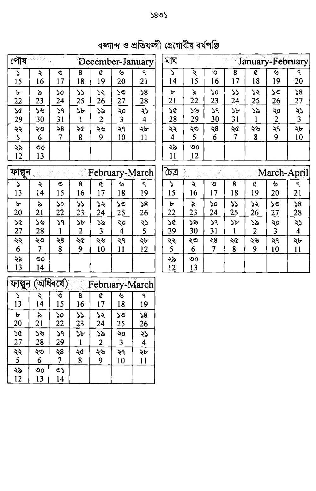

Python package for Bengali (i.e Bangabdo) date and time 

*Will be updated soon.*

## বাংলা বর্ষপঞ্জির সংস্কার
_উইকিপেডিয়া হতে_
> ১৯৫০-এর দশকে প্রখ্যাত জ্যোতিঃপদার্থবিজ্ঞানী ড. মেঘনাদ সাহাকে প্রদান করে ভারত সরকার ভারতবর্ষের দিনপঞ্জিকা সংস্কারের কমিটি গঠন করে। মেঘনাদ সাহা কমিটি ১৯৫৪ খ্রিষ্টাব্দে প্রচলিত প্রাচীন বর্ষপঞ্জিকার আমূল পরিবর্তন করে জ্যোতিঃপদার্থবিজ্ঞানের ভিত্তিতে প্রস্তাব পেশ করেন। এই কমিটির প্রস্তাব অনুযায়ী—
> 
> - বৈশাখ থেকে ভাদ্র— এই পাঁচ মাস ৩১ দিন গণনা করা হবে।
> - আশ্বিন থেকে চৈত্র— এই সাত মাস ৩০ দিন গণনা করা হবে।
> - অধিবর্ষে চৈত্র মাস ৩১ দিন গণনা করা হবে।
> 
> সাহা কমিটির প্রস্তাবসমুহ বাস্তবায়িত না হওয়ায় ভারত সরকার এস পি পান্ডের নেতৃত্বে আশির দশকে আরেকটি কমিটি করে। এই কমিটি মেঘনাদ সাহার প্রস্তাবসমূহকে মূল ধরে ১৪ই এপ্রিল বাংলা নববর্ষের প্রথম দিন হিসাবে নির্ধারণ করে প্রস্তাব পেশ করেন।
>
>বাংলাদেশও বেশ কয়েকবার বাংলা সন সংস্কারের উদ্যোগ নেয়। ১৯৬৩ সালে ড. মুহম্মদ শহীদুল্লাহর নেতৃত্বে 'বাংলা পঞ্জিকা সংস্কার' নামে বাংলা একাডেমি কমিটি গঠন করে যা 'শহীদুল্লাহ কমিটি' নামে পরিচিত হয়। এই কমিটি বিজ্ঞানী মেঘনাদ সাহার সুপারিশকে প্রাধান্য দিয়ে কিছু সংযোজন-বিয়োজন করে। এই কমিটি আধুনিক গ্রেগরীয় বর্ষপঞ্জি রীতি অনুসারে রাত ১২টা থেকে দিনের সুচনা করার অর্থাৎ তারিখ পরিবর্তনের প্রস্তাব দেয়। প্রচলিত মাপে সুর্যোদয়ে দিনের শুরু অর্থাৎ তারিখ পরিবর্তিত হতো।
>
> স্বাধীন বাংলাদেশে ১৯৮৮-৮৯ অর্থবছরে শহীদুল্লাহ কমিটির সুপারিশ গ্রহণ করে এর ভিত্তিতে বাংলা দিনপঞ্জিকা তৈরির নির্দেশ দেওয়া হয়। তবে এর পরেও কিছু সমস্যা দেখা দেয়। বাংলা বর্ষপঞ্জিকাকে আরও বিজ্ঞানভিত্তিক করার জন্য ১৯৯৫ সালের ২৬ জুলাই তৎকালীন বাংলা একাডেমির মহাপরিচালক হারুন-উর-রশিদকে প্রধান করে পদার্থবিজ্ঞানী, গণিতজ্ঞ, ভাষা, সাংস্কৃতিক ক্ষেত্রের প্রাজ্ঞ ব্যক্তিদের নিয়ে একটি টাস্কফোর্স গঠন করা হয়। এই কমিটি মেঘনাদ সাহা ও শহীদুল্লাহ কমিটির মূল সুপারিশের নিরিখে ২০টি সুপারিশ পেশ করে। এর উল্লেখযোগ্য ছিল চৈত্র মাসের পরিবর্তে ফাল্গুনকে অধিবর্ষের মাস হিসেবে নির্ধারণ করা। গ্রেগরীয় বর্ষপঞ্জিতে যে বছর ফেব্রুয়ারি মাস অধিবর্ষ হবে, সেই বছর বাংলা বর্ষপঞ্জিকায় ফাল্গুন মাস ৩০ দিনের পরিবর্তে হবে ৩১ দিন।
>
> তারপরেও জাতীয় দিবসগুলোয় গ্রেগরীয় বর্ষপঞ্জি ও বাংলা বর্ষপঞ্জি মূলানুগ না হওয়ায় জাতির ইতিহাস ও সংস্কৃতির গুরুত্বপূর্ণ দিনগুলো দুটো বর্ষপঞ্জিতে আলাদা দিনে পড়তো। যেমন ১৯৫২ সালের ২১শে ফেব্রুয়ারি বাংলা বর্ষপঞ্জির পাতায় দিনটি ৮ই ফাল্গুন হলেও ২০১৫ বাংলা বর্ষপঞ্জিতে তা পড়ে ৯ই ফাল্গুন। বাংলা বর্ষপঞ্জির এমন বিদ্যমান অসামঞ্জস্য দূর করে পুরোপুরি বিজ্ঞানভিত্তিক এবং জাতীয় দিবসগুলোকে মূলানুগ করতে ২০১৫ সালে বাংলা একাডেমির তৎকালীন মহাপরিচালক শামসুজ্জামান খানকে সভাপতি, ঢাকা বিশ্ববিদ্যালয়ের পদার্থবিজ্ঞানের অধ্যাপক অজয় রায়, পদার্থবিজ্ঞানী জামিল চৌধুরী, অধ্যাপক আলী আসগর, একাডেমির পরিচালক অপরেশ কুমার ব্যানার্জি প্রমুখ ব্যক্তিদের নিয়ে তৃতীয়বার বর্ষপঞ্জি সংস্কার কমিটি কমিটি করা হয়। এই কমিটি প্রধানত বিশেষ দিনগুলোয় গ্রেগরীয় বর্ষপঞ্জিকে ও বাংলা বর্ষপঞ্জিকে মূলানুগ করার বিষয়টিকে অগ্রাধিকার দিয়ে তাদের সুপারিশ পেশ করে। এই কমিটির প্রস্তাব অনুযায়ী—
>
> - বৈশাখ থেকে আশ্বিন— এই ছয় মাস ৩১ দিন গণনা করা হবে।
> - কার্তিক থেকে মাঘ এবং চৈত্র— এই পাঁচ মাস ৩০ দিন গণনা করা হবে।
> - ফাল্গুন মাস ২৯ দিনে গণনা করা হবে।
> - খ্রিষ্টাব্দের অনুগামী বছরে ফাল্গুন মাসে বঙ্গাব্দের অধিবর্ষ হবে অর্থাৎ যে খ্রিষ্টাব্দে অধিবর্ষ হবে সেই বাংলা বছরে ফাল্গুন মাস ৩০ দিনে গণনা করা হবে।
>
> বাংলাদেশে ২০১৯ খ্রিষ্টাব্দে শামসুজ্জামান খান কমিটির সুপারিশ অনুযায়ী সরকারি বর্ষপঞ্জি তৈরি করা হয়। বর্তমানে সরকারিভাবে এই বর্ষপঞ্জিই চালু আছে।

বর্তমান পাইথন প্যাকেজ বাংলাদেশে ২০১৯ সালে শামসুজ্জামান কমিটিকৃত সর্বশেষ সংশোধিত বর্ষপঞ্জি অনুসারে কাজ করে। অর্থাৎ এতে‍—
 - ১৪ই এপ্রিল পহেলা বৈশাখ।
 - বঙ্গাব্দের বিপরীতে খ্রিষ্টাব্দের অনুসঙ্গী তারিখ নির্দিষ্ট এবং সর্বদা বজায় থাকে।
 - বৈশাখ থেকে আশ্বিন— এই ছয় মাস ৩১ দিন গণনা করা হয়।
 - কার্তিক থেকে মাঘ এবং চৈত্র— এই পাঁচ মাস ৩০ দিন গণনা করা হয়।
 - ফাল্গুন মাস ২৯ দিনে গণনা করা হয়।
 - খ্রিষ্টাব্দের অনুগামী বছরে ফাল্গুন মাসে বঙ্গাব্দের অধিবর্ষ হবে অর্থাৎ যে খ্রিষ্টাব্দে অধিবর্ষ হবে সেই বাংলা বছরে ফাল্গুন মাস ৩০ দিনে গণনা করা হয়।

 

